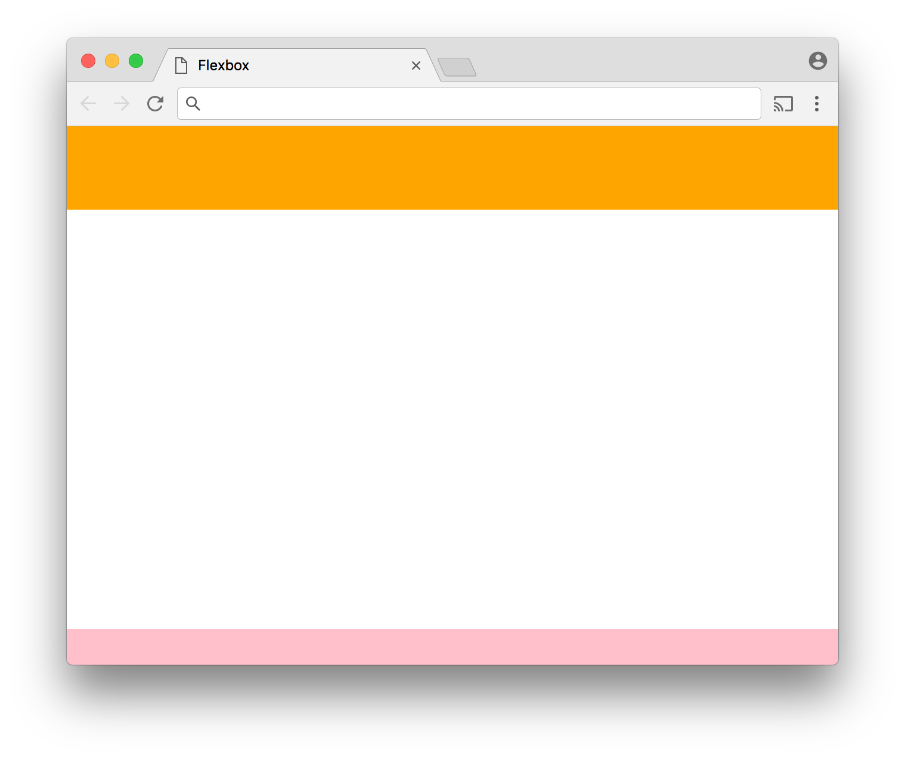
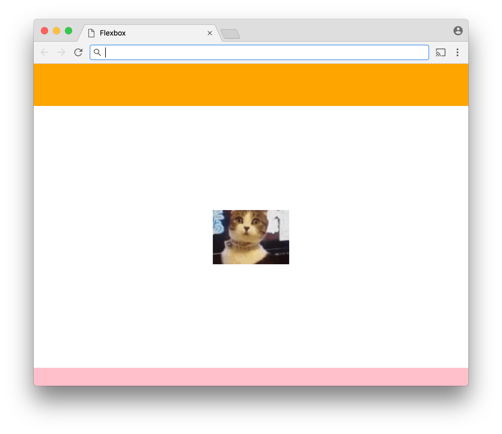
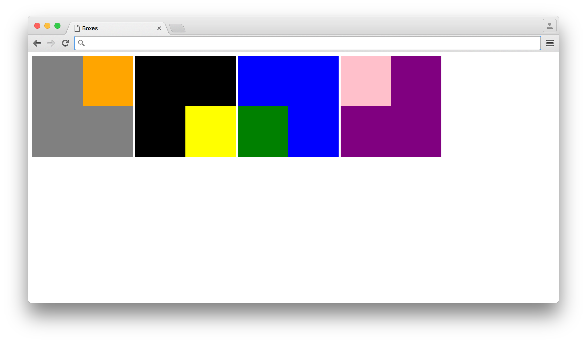
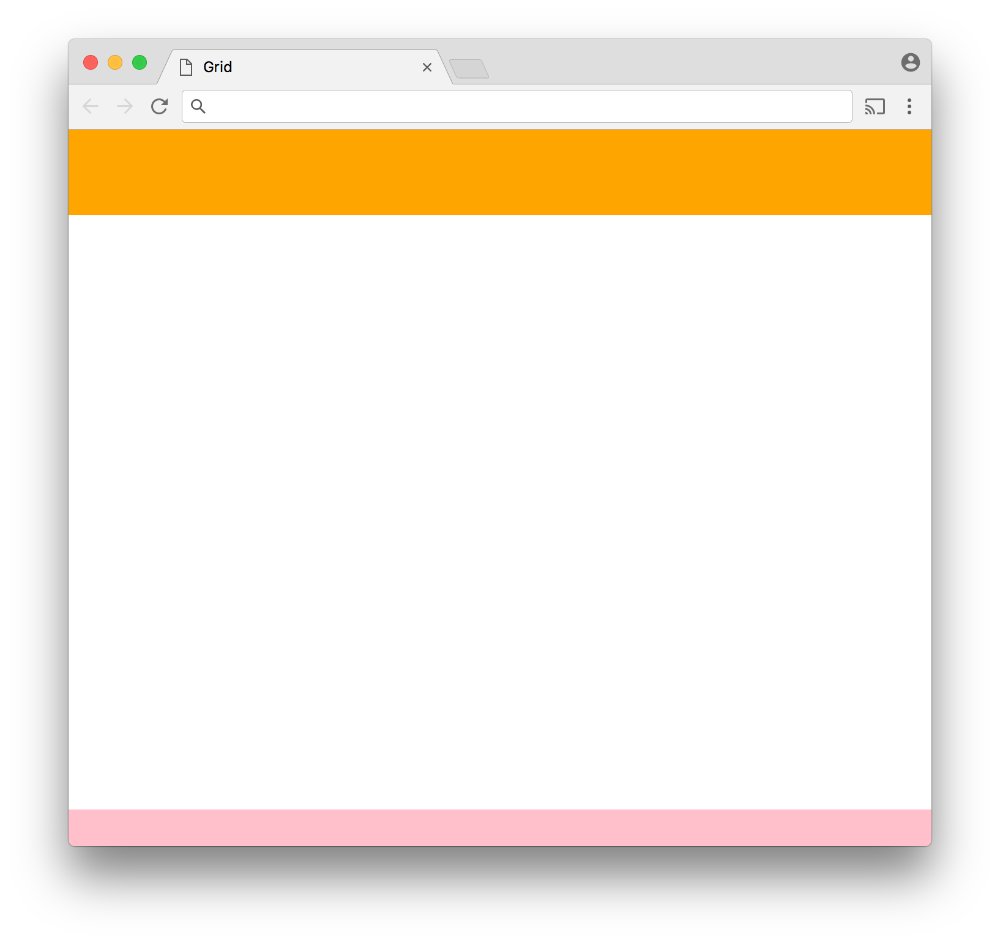

## Exercies

1. There's a fun game called [Flexbox Froggy](http://flexboxfroggy.com/) that will help you master Flexbox. Warning: it gets kind of hard at the end.

   #### My [solution](https://github.com/doctor-uz/2.JavaScript-HTML-CSS/tree/master/CSS-Flexbox_Grid_Ticker2/1-exercise-frog-game).


1. Create an HTML document with three elements in the `<body>` tag: a `<header>` element, a `<main>` element, and a `<footer>` element. The `<body>` should be made a flex container and have its `min-height` set to `100vh` so it fills the browser window. The `<header>` element should have a solid background color and be 70 pixels tall. The `<footer>` element should have a solid background color and be 30 pixels tall. The `<main>` element should fill the remainder of the available space.

   #### My [solution](https://github.com/doctor-uz/2.JavaScript-HTML-CSS/tree/master/CSS-Flexbox_Grid_Ticker2/2-exercise).

   

2. Copy the HTML document you created and add to the `<main>` element a single `` tag with its `src` attribute set to `https://bubble-medicine.glitch.me/gif?tag=kitty`. This url uses the [Giphy API](http://api.giphy.com/) to get a random gif so it will not be possible to know the width and height of the image that will be displayed in advance. Make the `<main>` element a flex container and have the `` element appear centered vertically and horizontally.

   #### My [solution](https://github.com/doctor-uz/2.JavaScript-HTML-CSS/tree/master/CSS-Flexbox_Grid_Ticker2/3-exercise).

   

3. Use Flexbox to reproduce the following design. Each outer box should be a flex container that contains only one flex item.

   #### My [solution](https://github.com/doctor-uz/2.JavaScript-HTML-CSS/tree/master/CSS-Flexbox_Grid_Ticker2/4-exercise).

   


   #### Grid Exercies

4. Create an HTML document with three elements in the `<body>` tag: a `<header>` element, a `<main>` element, and a `<footer>` element. The `<body>` should be have its `display` property set to `grid` and its `min-height` set to `100vh` so it fills the browser window. The `<header>` and `<footer>` elements should have solid backgrounds. Set new grid properties on the `<body>` element so that the `<header>` element is 70 pixels tall, the `<footer>` element is 30 pixels tall, and the `<main>` element fills the remaining space.

   #### My [solution](https://github.com/doctor-uz/2.JavaScript-HTML-CSS/tree/master/CSS-Flexbox_Grid_Ticker2/grid/2-exercise).

   

5. Use CSS Grid to reproduce the following design. Each outer box should be a grid container containing a single grid item.

   #### My [solution](https://github.com/doctor-uz/2.JavaScript-HTML-CSS/tree/master/CSS-Flexbox_Grid_Ticker2/grid/3-exercise).

   


#<p align="center"> Some Theory</p>


# Flexbox

[Flexbox](https://developer.mozilla.org/en-US/docs/Web/CSS/CSS_Flexible_Box_Layout/Using_CSS_flexible_boxes) is the name given to a new layout system available in CSS. With Flexbox, you specify in CSS how a containing element (a flex container) should allocate available space to its direct children (flex items). The container can grow or shrink the items within it to make the best use of the space available. Flexbox is particularly well suited to creating layouts that work across a variety of screen sizes. It also makes [many layouts](https://philipwalton.github.io/solved-by-flexbox/) that were historically difficult to achieve with CSS much easier.

To make an element a flex container, set it's `display` property to `flex` (or `inline-flex` if you want the container to behave as an inline element). With the `display` set thus, the children of the element become flex items. The following properties can be added to the container to specify how the items should be laid out:

- `flex-direction` - specifies the direction in which the items should flow. Possible values are `row` (left to right), `row-reverse` (right to left), `column` (top to bottom), and `column-reverse` (bottom to top). The default is `row`.
- `justify-content` - specifies how content is aligned and extra space distributed on the main axis (i.e., the axis specified by the `flex-direction` property). Possible values are `space-between` (the first item at the very beginning of the main axis, the last item at the very end, and the items in between separated by empty space), `space-around` (like `space-between` but with empty space before the first item and after the last), `center` (items clustered in the center), `flex-start` (items clustered at the beginning of the main axis), and `flex-end` (items clustered at the end of the main axis). 
- `align-items` - like `justify-content` but for the cross axis (which is the opposite axis of the main axis. If the `flex-direction` is `row` or `row-reverse`, the `align-items` property specifies vertical alignment. Otherwise, it specifies horizontal alignment). The possible values are `flex-start`, `flex-end`, `center`, `baseline` (the baselines of items are aligned), and `stretch` (the items are stretched to fill the container cross axis).
- `flex-wrap` - specifies whether and how items should wrap. Possible values are `nowrap`, `wrap`, and `wrap-reverse`. The default is `nowrap`.
- `align-content` - specifies how the lines of items should be spaced when wrapping is enabled. Possible values are `flex-start`, `flex-end`, `center`, `space-between`, `space-around`, and `stretch`.

There are also properties you can add to the individual flex items to control their alignment, sizing, and order of appearance.

- `order` - An integer that specifies the order in which an item should appear. The default value is `0`, which indicates that the item should appear in the order in which appears in the source HTML. A lower value indicates that the item should appear earlier and a higher value indicates that the item should appear later.
- `flex-basis` - Specifies the default size of an item before resizing.  Can be a specific value specified in units such as `px` or `%`. The default value is `auto`.
- `flex-grow` - A number greater than or equal to zero that specifies the factor by which the item should grow if there is space available. If a flex item has its `flex-grow` property set to `2` while all the other flex items have a `flex-grow` of `1`, it will be twice the size as all the others.
- `flex-shrink` - A number greater than or equal to zero that specifies the factor by which item should shrink if required.
- `flex` - Allows you to specify `flex-grow`, `flex-shrink`, and `flex-basis` (in that order) in one go. The `flex-shrink` and `flex-basis` values can be omitted.
- `align-self` - Allows you to override the flex container's `align-items` property for this individual item.

[CSS Tricks](https://css-tricks.com/snippets/css/a-guide-to-flexbox/) has a more thorough [guide to Flexbox](https://css-tricks.com/snippets/css/a-guide-to-flexbox/) featuring diagrams and demos. It is highly recommended that read it over and refer to it as you complete the exercises.


# CSS Grid

In the early days of the web, before CSS existed, it was common to use `<table>` elements to build layouts. It was really the only way to get content to go precisely where you wanted it to go. After popular browsers gained support for CSS, using `<table>` elements in this way became widely frowned upon for several reasons. One is that it violates principles of [semantic markup](../semantic_markup). If you are using `<table>` elements for layout, you are putting all kinds of content in  `<table>` tags when the only type of content that belongs there is tabular data, such as bus schedules or tax brackets. Another reason using `<table>` elements for layouts became uncool is that it runs against a core idea of CSS. CSS aims to separate from content the description of how it is supposed to look. If you are using `<table>` elements to place content on your page then you are mixing up your content and your layout information. Also, a `<table>` tends to involve a lot of markup and provides a lot of opportunity to accidentally do something invalid. 

So the use of `<table>` declined dramatically while the use of `<div>` went through the roof. Yet a desire to use `<table>`, or something like it, lingered. Many quite common layouts are difficult to achieve using absolute or relative positioning, left and right floats, margin, padding, etc. while they are relatively easy using `<table>` elements. Also, as a visual survey of websites will make clear, it is extremely common for web pages to be laid out in a grid. So it makes sense to describe their layouts as grids.

For a long time it has been possible to use tables without using `<table>` elements - by setting a non-`<table>` element's `display` property to `table`, `table-cell`, etc., and thereby avoid some of the issues that led to `<table>` falling out of favor. But now we have [CSS Grid Layout](https://developer.mozilla.org/en-US/docs/Web/CSS/CSS_Grid_Layout) - a brand new way to describe a grid layout in CSS that addresses all the concerns with the older techniques and even allows you to do some things that were never possible with `<table>` elements.

CSS Grid is so new that it is [not yet supported in all widely used browsers](http://www.caniuse.com/#feat=css-grid) but the day when it can be safely used in production will soon be upon us.

## Usage

CSS Grid works similarly to [Flexbox](../flexbox). To turn an element into a grid container, you set its `display` property to `grid`  or `inline-grid`. You can then add `grid-template-rows` and `grid-template-columns` properties to describe the rows and columns of the grid.

```css
#my-grid {
    display: grid;
    grid-template-rows: 100px 200px;
    grid-template-columns: 40% 1fr 2fr;
}
```

The example above creates a grid with two rows and three columns. The first row is 100 pixels tall and the second is 200 pixels tall. The first column takes up 40% of the available width. The second and third columns are specified with a new unit invented for CSS Grid - `fr`, which represent one part of the remaining space. Since the first column takes up 40%, the remaining space is 60%. Thus, `1fr` equals 20% and `2fr` represents 40%. This means that we could simply replace `40% 1fr 2fr` with `40% 20% 40%`. The `fr` unit is more useful when not dealing with percentages. If the first column were specified with pixels, we would not be able to say how much space is left over and using `fr` would be necessary for the other columns. 

If we added six child elements to this grid container, they would automatically occupy the six cells in the grid, filling them in the order in which they appear in the source. However, it is not required that we add six items. Consider the CSS for a single item presented below.

```css
#my-grid-item {
    grid-row: 2;
    grid-column: 1 / 3;
}
```

This single item would appear in the second row and span the first two columns. The first value in `grid-row` and `grid-column` specifies where in the grid the item should start. The second value, separated from the first with a `/`, indicates where the item should end. By setting the `grid-column` property to `1 / 3`, we are saying the item should start in the first column and go up to (but not into) the third. Thus it occupies the first two columns and the third column remains empty. Another way to achieve this same effect would be to use the word `span` to indicate how many columns should be spanned rather than the column at which the spanning should end.

```css
#my-grid-item {
    grid-row: 2;
    grid-column: 1 / span 2;
}
```

There are many more details to CSS Grid beyond these basics. A more thorough [introduction](https://developers.google.com/web/updates/2017/01/css-grid) is available at [developers.google.com](https://developers.google.com/web/updates/2017/01/css-grid) and it is recommended that you read through it and refer to it as the need arises.
