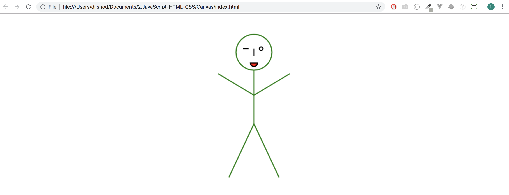
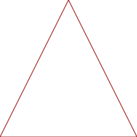

## Exercise

Draw a <a href="stick_figure.png">stick figure</a> using a `<canvas>` element.

#### My [solution](https://github.com/doctor-uz/2.JavaScript-HTML-CSS/tree/master/Canvas).




# <p align="center"> Some Theory</p>


# Canvas

The <a href="https://developer.mozilla.org/en-US/docs/Web/API/Canvas_API">`<canvas>`</a> element allows you to draw custom graphics and animations.

You start by adding the element. It is important to give the canvas width and height attributes. If you just set the width and height in CSS you will get unexpected results.

```html
<canvas id="canv" width="200" height="200"></canvas>
```

You then use Javascript to get a reference to it and from that a _rendering context_.

```js
var context = document.getElementById('canv').getContext('2d');
```

There are other kinds of contexts you can get (for doing <a href="https://developer.mozilla.org/en-US/docs/Web/API/WebGL_API">WebGL</a> graphics, for example) but we are only interested in drawing 2D graphics here.

You draw by calling methods of the context object.

```js
context.strokeStyle = '#900';
context.beginPath();
context.moveTo(100, 0);
context.lineTo(0, 200);
context.moveTo(100, 0);
context.lineTo(200, 200)
context.lineTo(0, 200);
context.stroke();
```

After running these commands the canvas will look like this:



## Useful context methods and properties

* <a href="https://developer.mozilla.org/en-US/docs/Web/API/CanvasRenderingContext2D/strokeStyle">`strokeStyle`</a> - Gets and sets the style of lines

* <a href="https://developer.mozilla.org/en-US/docs/Web/API/CanvasRenderingContext2D/fillStyle">`fillStyle`</a> - Gets and sets the style for filling in shapes

* <a href="https://developer.mozilla.org/en-US/docs/Web/API/CanvasRenderingContext2D/fillRect">`fillRect`</a> - Draws a solid rectangle of the specified width and height at the specified coordinates

* <a href="https://developer.mozilla.org/en-US/docs/Web/API/CanvasRenderingContext2D/strokeRect">`strokeRect`</a> - Draws the outline of a rectangle of the specified width and height at the specified coordinates

* <a href="https://developer.mozilla.org/en-US/docs/Web/API/CanvasRenderingContext2D/clearRect">`clearRect`</a> - Erases the specified rectangular area. This method is very useful for clearing the entire canvas prior to drawing a new frame of animation

* <a href="https://developer.mozilla.org/en-US/docs/Web/API/CanvasRenderingContext2D/beginPath">`beginPath`</a> - Creates a new path. Subsequent commands add to the path until <a href="https://developer.mozilla.org/en-US/docs/Web/API/CanvasRenderingContext2D/closePath">`closePath`</a> is called.

* <a href="https://developer.mozilla.org/en-US/docs/Web/API/CanvasRenderingContext2D/moveTo">`moveTo`</a> - Moves the 'pen' to the specified coordinates

* <a href="https://developer.mozilla.org/en-US/docs/Web/API/CanvasRenderingContext2D/stroke">`stroke`</a> - Draws the outline of a shape in the current `strokeStyle`

* <a href="https://developer.mozilla.org/en-US/docs/Web/API/CanvasRenderingContext2D/fill">`fill`</a> - Fills a shape in the current `fillStyle`;

* <a href="https://developer.mozilla.org/en-US/docs/Web/API/CanvasRenderingContext2D/lineTo">`lineTo`</a> - Adds a line from the current position of the 'pen' to the specified coordinates.

* <a href="https://developer.mozilla.org/en-US/docs/Web/API/CanvasRenderingContext2D/arc">`arc`</a> - Adds an arc with the specified center, radius, and start and end angles. Note that angles are specified with <a href="https://www.google.com/search?q=radians+to+degrees+formula&tbm=isch">radians</a> rather than degrees

* <a href="https://developer.mozilla.org/en-US/docs/Web/API/CanvasRenderingContext2D/drawImage">`drawImage`</a> - Draws an image to the canvas. Canvases can themselves be used as images in other canvases.

